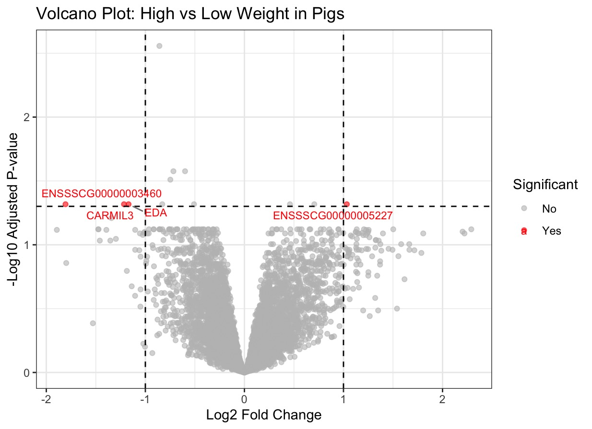
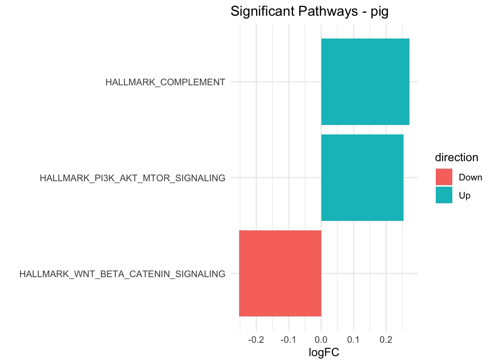
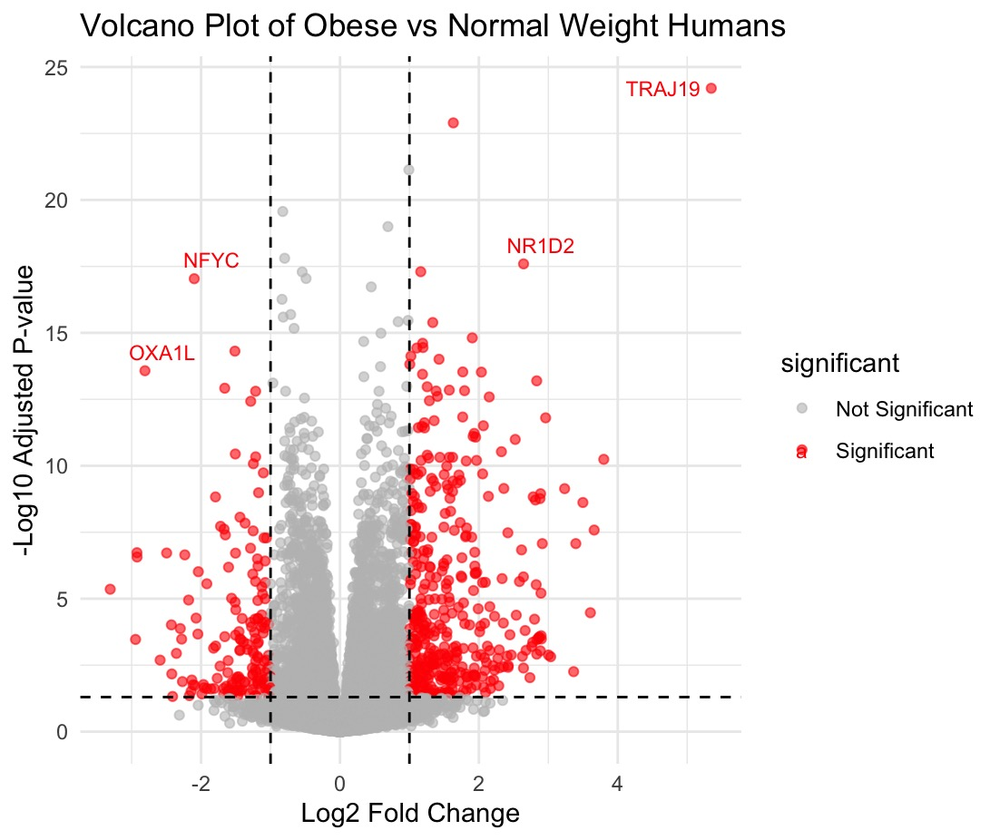
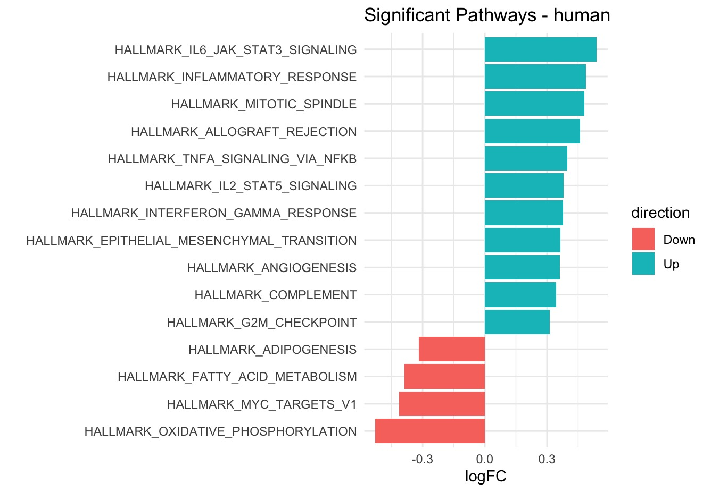
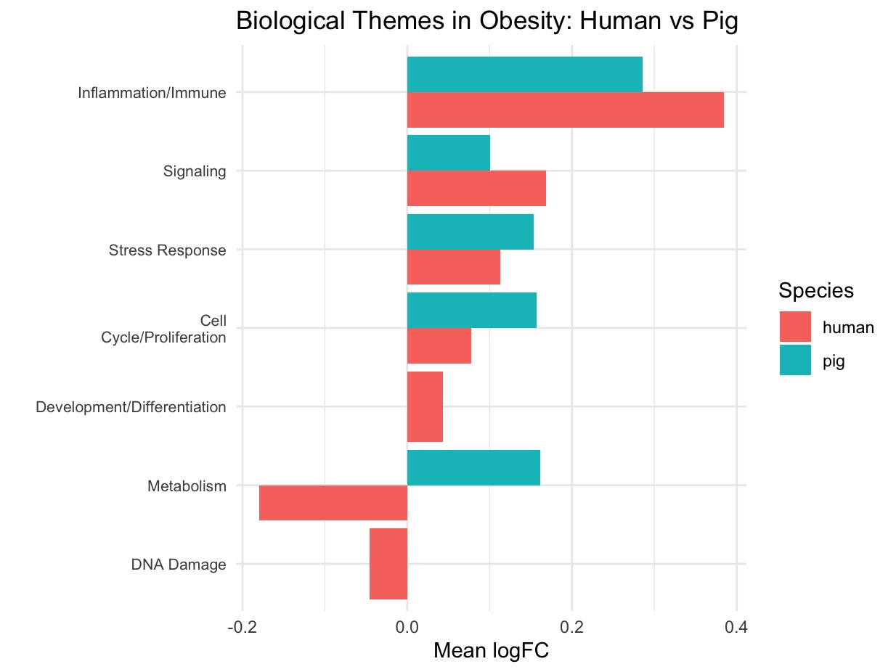

# Results

This page presents the main results from the pig and human adiposity datasets. Figures are organized by dataset, followed by a cross-species comparison.

<br><br>

# Pig Dataset Analysis

This section presents figures and analysis based on the *Sus scrofa* adiposity dataset.

<br>

## Pig Obesity PCA

```{r}
#| echo: false
#| message: false
#| warning: false

library(ggplot2)
library(plotly)
library(dplyr)

counts <- read.csv(
  "data/GSE61271_normalizeddata.csv",
  row.names = 1,
  check.names = FALSE,
  stringsAsFactors = FALSE
)

counts <- as.matrix(counts)
mode(counts) <- "numeric"

metadata <- read.csv("data/GSE61271_sample_metadata.csv")

metadata$sample_number <- gsub("_SusScrofa", "", metadata$title)

metadata2 <- metadata[match(colnames(counts), metadata$sample_number), ]

if (any(is.na(metadata2$biological_state))) {
  stop("Sample matching failed.")
}

gene_var <- apply(counts, 1, var, na.rm = TRUE)
top_genes <- names(sort(gene_var, decreasing = TRUE))[1:500]
counts_top <- counts[top_genes, ]

pca_res <- prcomp(t(counts_top), scale. = TRUE)

pca_var <- pca_res$sdev^2
pca_var_perc <- round(100 * pca_var / sum(pca_var), 1)

pca_df <- data.frame(
  PC1 = pca_res$x[, 1],
  PC2 = pca_res$x[, 2],
  Obesity = factor(metadata2$biological_state, levels = c("High", "Mean", "Low")),
  Sex = metadata2$Sex,
  Sample = metadata2$title
)

p <- ggplot(
  pca_df,
  aes(
    x = PC1,
    y = PC2,
    color = Obesity,
    text = paste(
      "Sample:", Sample,
      "<br>Obesity:", Obesity,
      "<br>Sex:", Sex,
      "<br>PC1:", round(PC1, 2),
      "<br>PC2:", round(PC2, 2)
    )
  )
) +
  geom_point(size = 4) +
  xlab(paste0("PC1 (", pca_var_perc[1], "%)")) +
  ylab(paste0("PC2 (", pca_var_perc[2], "%)")) +
  theme_minimal() +
  ggtitle("PCA of Pig RNA-seq Samples by Obesity Group")

ggplotly(p, tooltip = "text")
```

**Figure analysis:** Principal component analysis shows individual pig samples colored by obesity level. PCA was performed using the top 500 most variable genes from normalized RNA-seq counts. The three obesity groups show noticeable overlap, suggesting the pig dataset may not strongly separate by obesity level alone. However, it is still useful because it includes low, mean, and high adiposity groups, allowing obesity progression to be examined.

<br><br>

## Pig Differential Expression Volcano Plot



**Figure analysis:** This volcano plot compares gene expression between high-weight and low-weight pigs. Red points represent significantly differentially expressed genes based on the chosen p-value and log2 fold-change thresholds. The small number of significant genes suggests that obesity-related gene expression differences in pigs may be more subtle compared to humans.

<br><br>

## Pig Hypothesis-Driven Gene Trend Correlation

```{r}
#| echo: false
#| message: false
#| warning: false

library(readxl)
library(dplyr)
library(ggplot2)
library(plotly)

data <- read_excel("data/GSE61271_gene_names_and_GSM_headers.xlsx")
data <- as.data.frame(data)

data$Gene <- as.character(data$Gene)
data$Gene[is.na(data$Gene) | data$Gene == ""] <- paste0("Unknown_", which(is.na(data$Gene) | data$Gene == ""))

data <- data[!grepl("^ENSSSCG", data$Gene, ignore.case = TRUE), ]

rownames(data) <- make.unique(data$Gene)

data$Gene <- NULL
data$Gene_name <- NULL

data[] <- lapply(data, function(x) as.numeric(as.character(x)))

data <- data[complete.cases(data), ]

row_var <- apply(data, 1, var, na.rm = TRUE)
data <- data[row_var > 0, ]

hypothesis_genes <- c(
  "LEP", "RETN", "FABP4", "PLIN1",
  "CFD", "NAMPT", "SERPINE1", "SOCS3"
)

present_genes <- hypothesis_genes[hypothesis_genes %in% rownames(data)]

hyp_data <- data[present_genes, ]

metadata <- read.csv("data/GSE61271_sample_metadata.csv")

metadata2 <- metadata[match(colnames(hyp_data), metadata$geo_accession), ]

state_numeric <- as.numeric(factor(
  metadata2$biological_state,
  levels = c("Low", "Mean", "High")
))

gene_trends <- apply(hyp_data, 1, function(x) {
  cor(x, state_numeric, method = "spearman")
})

trend_labels <- ifelse(
  gene_trends > 0.3, "Increasing",
  ifelse(gene_trends < -0.3, "Decreasing", "No clear trend")
)

trend_df <- data.frame(
  Gene = names(gene_trends),
  Correlation = gene_trends,
  Trend = trend_labels
)

p <- ggplot(
  trend_df,
  aes(
    x = Gene,
    y = Correlation,
    fill = Trend,
    text = paste(
      "Gene:", Gene,
      "<br>Correlation:", round(Correlation, 3),
      "<br>Trend:", Trend
    )
  )
) +
  geom_bar(stat = "identity") +
  geom_hline(yintercept = 0.3, linetype = "dashed") +
  geom_hline(yintercept = -0.3, linetype = "dashed") +
  geom_hline(yintercept = 0, color = "black") +
  labs(
    title = "Correlation Trends of Hypothesis Genes Across Adiposity Levels",
    x = "Hypothesis Genes",
    y = "Spearman Correlation with Adiposity",
    fill = "Trend"
  ) +
  theme_minimal()

ggplotly(p, tooltip = "text")
```

**Figure analysis:** A bar graph was used to assess how selected adiposity-related genes correlate with increasing adiposity. Each bar represents the Spearman correlation for a gene, indicating whether expression increases, decreases, or shows no clear trend. Of the hypothesized genes, four (PLIN1, CFD, NAMPT, SERPINE1) were present. Notably, NAMPT and SERPINE1 showed positive correlations above 0.3, indicating increased expression with higher adiposity, while the others showed weaker or inconsistent trends. Overall, the results partially support the hypothesis, suggesting gene-specific rather than uniform expression changes.

<br><br>

## Pig Top 30 Most Variable Genes Heatmap

```{r}
#| echo: false
#| message: false
#| warning: false

library(readxl)
library(dplyr)
library(heatmaply)
library(htmlwidgets)

data <- read_excel("data/GSE61271_gene_names_and_GSM_headers.xlsx")
data <- as.data.frame(data)

data$Gene <- as.character(data$Gene)
data$Gene[is.na(data$Gene) | data$Gene == ""] <- paste0("Unknown_", which(is.na(data$Gene) | data$Gene == ""))

data <- data[!grepl("^ENSSSCG", data$Gene, ignore.case = TRUE), ]

rownames(data) <- make.unique(data$Gene)

data$Gene <- NULL
data$Gene_name <- NULL

data[] <- lapply(data, function(x) as.numeric(as.character(x)))

data <- data[complete.cases(data), ]

row_var <- apply(data, 1, var, na.rm = TRUE)
data <- data[row_var > 0, ]

gene_variance <- apply(data, 1, var, na.rm = TRUE)
top_genes <- names(sort(gene_variance, decreasing = TRUE))[1:30]
heatmap_data <- data[top_genes, ]

metadata <- read.csv("data/GSE61271_sample_metadata.csv")

metadata2 <- metadata[match(colnames(heatmap_data), metadata$geo_accession), ]

colnames(heatmap_data) <- paste(
  colnames(heatmap_data),
  metadata2$biological_state,
  sep = " | "
)

annotation_col <- data.frame(
  BiologicalState = metadata2$biological_state
)

rownames(annotation_col) <- colnames(heatmap_data)

hm <- heatmaply(
  as.matrix(heatmap_data),
  scale = "row",
  Rowv = TRUE,
  Colv = TRUE,
  column_side_colors = annotation_col,
  colors = colorRampPalette(c("blue", "white", "red"))(100),
  xlab = "Samples",
  ylab = "Genes",
  main = "Top 30 Most Variable Genes",
  fontsize_row = 8,
  fontsize_col = 8
)

hm
```

**Figure analysis:** This heatmap shows an unbiased analysis of overall gene expression was conducted using the top 30 most variable genes across adiposity levels. The heatmap shows clear differences between low and high adiposity groups, reflected by distinct blue (low expression) and red (high expression) patterns. This suggests a proportional relationship between adiposity and gene expression for certain genes. The accompanying dendrogram groups genes with similar expression patterns, indicating potential co-regulated gene clusters that may be involved in shared biological processes such as immune response, inflammation, and oxygen transport.

<br><br>

## Pig Heatmaps by Biological State

```{r}
#| echo: false
#| message: false
#| warning: false

make_heatmap <- function(state_name) {
  samples <- rownames(annotation_col)[annotation_col$BiologicalState == state_name]
  
  state_data <- heatmap_data[, samples]
  
  colnames(state_data) <- paste(
    colnames(state_data),
    state_name,
    sep = " | "
  )
  
  state_annotation <- data.frame(
    BiologicalState = annotation_col[samples, "BiologicalState"]
  )
  
  rownames(state_annotation) <- colnames(state_data)
  
  heatmaply(
    as.matrix(state_data),
    scale = "row",
    Rowv = TRUE,
    Colv = TRUE,
    column_side_colors = state_annotation,
    colors = colorRampPalette(c("blue", "white", "red"))(100),
    xlab = "Samples",
    ylab = "Genes",
    main = paste("Top 30 Overall Genes -", state_name, "Biological State"),
    fontsize_row = 8,
    fontsize_col = 8
  )
}
```

::: {.panel-tabset}

## Low

```{r}
#| echo: false
#| message: false
#| warning: false

make_heatmap("Low")
```

## Mean

```{r}
#| echo: false
#| message: false
#| warning: false

make_heatmap("Mean")
```

## High

```{r}
#| echo: false
#| message: false
#| warning: false

make_heatmap("High")
```

:::

**Figure analysis:** To further investigate gene expression changes, the data were separated by biological state (low, mean, high adiposity) while keeping the same set of top genes for comparison. Although the heatmaps may initially appear inconsistent, they reflect the same genes across different adiposity groups. Closer examination shows that genes such as PCK1, TREH, LYZ, SPP1, CSF3R, PADI2, MSR1, and DDX60 increase in expression together as adiposity rises, suggesting coordinated involvement in metabolic and inflammatory processes. At the same time, other genes decrease in expression, indicating that adiposity is associated with both upregulation and downregulation of different biological pathways.

<br><br>

## Pig Significant Pathways



**Figure analysis:** This bar graph shows significantly upregulated and downregulated pathways in the pig dataset. Upregulated immune and signaling pathways suggest obesity-related inflammation and adipose tissue remodeling. Downregulated pathways may indicate disruption of normal metabolic regulation during obesity progression.

<br><br>

# Human Dataset Analysis

This section presents figures and analysis based on the human adiposity dataset.

<br>

## Human BMI PCA

```{r}
#| echo: false
#| message: false
#| warning: false

library(readr)
library(DESeq2)
library(tidyverse)
library(plotly)

counts_data <- read_tsv("data/GSE162653_raw_counts_GRCh38.p13_NCBI.tsv")
colData <- read.csv("data/GSE162653_sample_metadata.csv")

rownames(colData) <- colData$GSM

rownames(counts_data) <- counts_data$GeneID
counts_data <- counts_data[, -1]

counts_data <- as.data.frame(counts_data)
counts_data[] <- lapply(counts_data, as.numeric)
counts_data <- round(as.matrix(counts_data))

colData <- colData[match(colnames(counts_data), rownames(colData)), ]

dds <- DESeqDataSetFromMatrix(
  countData = counts_data,
  colData = colData,
  design = ~ treatment.group
)

keep <- rowSums(counts(dds)) >= 10
dds <- dds[keep, ]

dds$treatment.group <- relevel(
  dds$treatment.group,
  ref = "Fish oil (3g/day 1.1g EPA + 0.8g DHA)"
)

vsd <- vst(dds, blind = FALSE)

pca_data <- plotPCA(vsd, intgroup = "bmi.group", returnData = TRUE)

percentVar <- round(100 * attr(pca_data, "percentVar"), 1)

p <- ggplot(
  pca_data,
  aes(
    x = PC1,
    y = PC2,
    color = bmi.group,
    text = paste(
      "Sample:", name,
      "<br>BMI Group:", bmi.group,
      "<br>PC1:", round(PC1, 2),
      "<br>PC2:", round(PC2, 2)
    )
  )
) +
  geom_point(size = 4) +
  xlab(paste0("PC1 (", percentVar[1], "%)")) +
  ylab(paste0("PC2 (", percentVar[2], "%)")) +
  theme_minimal() +
  ggtitle("Human Dataset PCA by BMI Group")

ggplotly(p, tooltip = "text")
```

**Figure analysis:** This PCA shows individual human samples colored by BMI group. The separation between normal weight and obese samples suggests stronger obesity-related expression differences in the human dataset compared with the pig dataset.

<br><br>

## Human Differential Expression Volcano Plot



**Figure analysis:** This volcano plot compares gene expression between normal weight and obese humans. Red points represent significantly differentially expressed genes based on adjusted p-value and log2 fold-change thresholds. The larger number of significant genes suggests stronger obesity-associated gene expression changes in humans.

<br><br>

## Human Significant Pathways



**Figure analysis:** This pathway bar graph shows significant pathway activity changes in the human dataset. Many upregulated pathways are linked to inflammation, stress response, and obesity-related signaling, supporting the idea that obesity is associated with chronic low-grade inflammation and altered metabolism.

<br><br>

# Cross-Species Comparison

<br>

## Human vs Pig Pathway Theme Concordance



**Figure analysis:** This bar graph compares pathway-level trends between the human and pig datasets. Inflammatory pathway activity appears shared across species, while metabolism-related differences may reflect differences in obesity timeline, since the human samples represent established obesity while the pig samples may reflect a more recent progression toward higher adiposity.

<br><br>